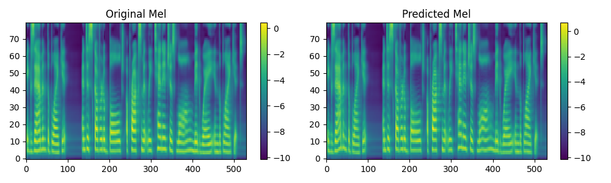

# FastSpeech-Pytorch
The Implementation of FastSpeech Based on Pytorch.

Modified from [xcmyz/fastspeech](https://github.com/xcmyz/FastSpeech)

Add Conformer and UNet Post-Net, which can be called in `hparams.py`.

This repo does not include alignment and dataset. Pretrained models(201000 steps) are in the google drive link:

https://drive.google.com/drive/folders/13F2oh1gdOTvsYBwyvMuJ34BBCq97wK2c?usp=sharing

Comparison of mels before(original) and after post-net(predicted) is here:
